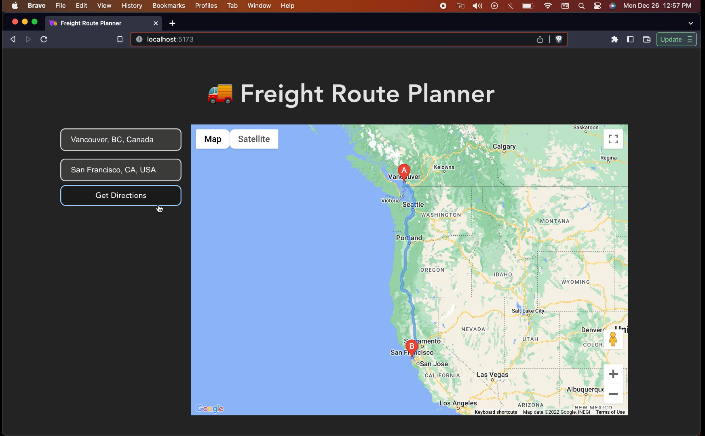
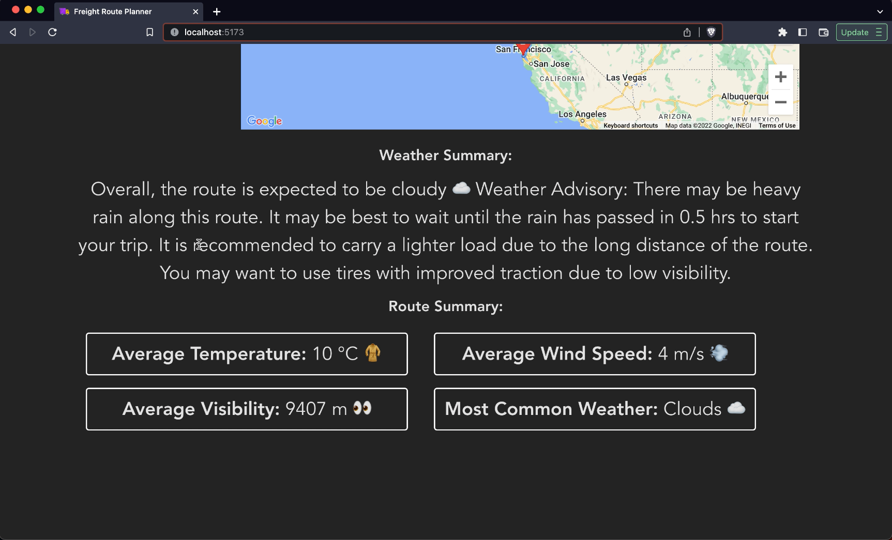

# Freight Route Planner

Simple, blazingly-fast web application that allows freight drivers to plan out their route based on current weather patterns, load-size and equipment. Built over a weekend during winter break. Inspired by the millions of hard-working delivery drivers who have to work especially hard over the holiday season. This application aims to make their jobs easier and more efficient by providing them with the tools they need to navigate the roads safely and efficiently.

 


https://user-images.githubusercontent.com/102765426/209590320-560d0313-ef59-48c8-81f2-87ddceb5e17a.mp4


## Solution
Freight Route Planner is a web application that allows trucking companies to easily plan and optimize their routes by taking into account various factors such as weather and the load being carried. Many trucking companies struggle to efficiently plan and optimize their routes, resulting in wasted time and fuel. This application is designed to be simple, fast, and responsive, providing users with the necessary information to make informed decisions about their routes.

With Freight Route Planner, users can input the start and end points of their freight route and receive a summary and report of the weather along the route. This includes information on visibility, temperature, wind speed, precipitation, and any weather advisories. The application also provides recommendations on the best time to leave based on the weather, as well as suggestions for the type of tires to use and visibility conditions. The summaries are generated using natural language generation techniques to provide a more readable and user-friendly experience.

## Features
- Input start and end points for freight routes
- Calculate the best route based on various factors such as weather and load
- Provide a detailed summary and report of the weather along the route, including visibility, temperature, wind speed, precipitation, and any weather advisories
- Recommend the best time to leave based on the weather
- Suggest the appropriate tires to use based on the weather and road conditions
- Improve visibility and safety for truck drivers on the road
- Monitor real-time traffic conditions along the route and adjust the route as needed
- Estimate the cost of the route based on fuel consumption and tolls
- Allow users to customize their routes by adding waypoints or avoiding certain areas
- Save and manage multiple routes for easy access and comparison

## Technical Details
Freight Route Planner is a web application built using the Svelte framework and a Python server using the Flask framework to handle the backend logic. The Svelte framework was chosen for its lightweight and efficient design, which allows for fast and responsive performance. Svelte uses a reactive approach to building user interfaces, meaning that the application only updates the parts of the page that need to change, rather than rebuilding the entire page every time. This results in a smooth and seamless user experience.

The Flask framework was chosen for its simplicity and ease of use. It is a popular choice for building web servers and APIs, and is well-suited for small to medium-sized projects. It provides a lightweight and flexible way to handle HTTP requests and responses, and can be easily extended with a wide range of plugins and libraries.

To set up the application, you will need to install the necessary dependencies and configure the API keys. First, you will need to install Node.js, which is required to run the Svelte application. You can download the latest version of Node.js from the official website (https://nodejs.org/). Once Node.js is installed, you can install the Svelte CLI by running the following command:
```
npm install -g svelte-cli
```
Next, you will need to install the necessary Python dependencies for the Flask server. You will need to have Python 3 installed on your system. You can check if you already have Python installed by running the following command:
```
python --version
```
If Python is not installed, you can download the latest version from the official website (https://www.python.org/). Once Python is installed, you can create a virtual environment and install the necessary dependencies by running the following commands:
```
python -m venv venv
source venv/bin/activate
pip install -r requirements.txt
```
Finally, you will need to obtain API keys for the Google Maps API and the OpenWeatherMap API. You can sign up for these services on their respective websites and obtain your API keys. Once you have your keys, you will need to create a file called secrets.py in the root directory of the project, and add the following lines, replacing YOUR_API_KEY with your actual API key:
```javascript
GOOGLE_MAPS_API_KEY = 'YOUR_API_KEY'
OPENWEATHERMAP_API_KEY = 'YOUR_API_KEY'
```
With the dependencies installed and the API keys configured, you can start the application by running the following commands:
```
cd frontend
npm install
npm run build
cd ..
flask run
```
This will start the Svelte application and the Flask server, allowing you to access the application in your web browser at http://localhost:5173.


